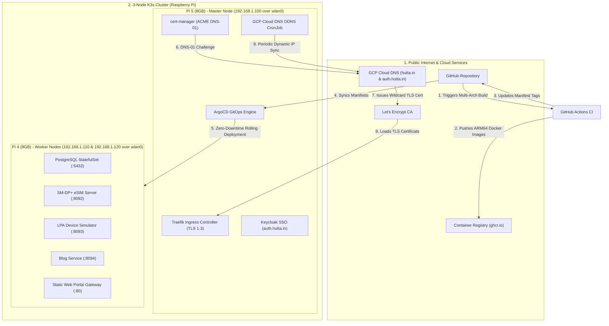

# hutta.in Platform: Automated 3-Node Raspberry Pi Kubernetes Cluster

This repository contains the complete codebase, microservices, containerization Dockerfiles, and Infrastructure as Code (IaC) required to run the `hutta.in` Consumer/IoT eSIM platform on a **3-node Raspberry Pi Kubernetes cluster** (**1x Raspberry Pi 5 8GB Master** + **2x Raspberry Pi 4 8GB Workers**).

---

## 1. System & Architecture Overview



---

## 2. Infrastructure as Code (IaC) Directory (`website-iac/`)

All infrastructure code, playbooks, manifests, and scripts reside inside [`website-iac/`](file:///Users/muku/Projects/website/website-iac):

```text
website-iac/
├── terraform/                      # Terraform GCP Cloud DNS & Service Account IAM
├── ansible/                        # Ansible OS Hardening (tmpfs, noatime, UFW) & K3s Install
├── k8s/                            # Declarative Kubernetes Manifests (Synced by ArgoCD)
│   ├── argocd/                     # GitOps Root Application
│   ├── infrastructure/             # PostgreSQL DB, Keycloak SSO, cert-manager, DDNS, Monitoring
│   └── apps/                       # Web Portal, SM-DP+, LPA Simulator, Blog Service, Ingress
├── scripts/                        # Health Diagnostic Verification Script
└── README.md                       # Comprehensive IaC Execution Guide
```

---

## 3. Platform Microservices & Containers

| Service | Technology | Port | Database | Security & OIDC |
|---|---|---|---|---|
| **Static Web Portal Gateway** | Nginx 1.27 Alpine | 80 / 443 | - | TLS 1.3, Gzip, Security Headers |
| **Keycloak SSO Engine** | Keycloak 26 (Quarkus) | 8080 | `keycloakdb` | OIDC Authorization Code Flow with PKCE, Admin IP Restricted (`192.168.1.0/24`) |
| **SM-DP+ eSIM Server** | Spring Boot (Java 25 JRE Alpine) | 8092 | `smdpdb` | OIDC RS256 JWT Validation, GSMA Root CI mTLS |
| **LPA Device Simulator** | Spring Boot (Java 25 JRE Alpine) | 8093 | `lpadb` | OIDC RS256 JWT Validation |
| **Blog Technology Service** | Spring Boot (Java 25 JRE Alpine) | 8094 | `blogdb` | OIDC RS256 JWT Validation |

---

## 4. Quick Start Guide

### Step 1: Install Raspberry Pi OS Lite & Set Static IPs
Install Raspberry Pi OS Lite (64-bit) manually and assign static IP addresses (or router DHCP reservations):
* **`rbpi-master`**: `192.168.1.100` (Raspberry Pi 5 8GB)
* **`rbpi-worker-01`**: `192.168.1.110` (Raspberry Pi 4 8GB)
* **`rbpi-worker-02`**: `192.168.1.120` (Raspberry Pi 4 8GB)

### Step 2: Apply Cloud DNS & IAM (Terraform)
```bash
cd website-iac/terraform
terraform init
terraform apply -auto-approve
cd ../..
```

### Step 3: Run Automated Node Hardening & K3s Setup (Ansible)
```bash
cd website-iac/ansible
ansible-playbook -i inventory.ini playbooks/01-prep-nodes.yml
ansible-playbook -i inventory.ini playbooks/02-autoupdates.yml
ansible-playbook -i inventory.ini playbooks/03-install-k3s.yml
cd ../..
```

### Step 4: Deploy GitOps & In-Cluster Infrastructure
```bash
kubectl create namespace argocd
kubectl apply --server-side --force-conflicts -n argocd -f https://raw.githubusercontent.com/argoproj/argo-cd/stable/manifests/install.yaml
kubectl apply -f https://github.com/cert-manager/cert-manager/releases/download/v1.16.2/cert-manager.yaml

kubectl create secret generic gcp-sa-credentials \
  --from-file=service-account-key.json=website-iac/terraform/service-account-key.json \
  -n kube-system

kubectl apply -f website-iac/k8s/infrastructure/postgres-db.yaml
kubectl apply -f website-iac/k8s/infrastructure/keycloak-sso.yaml
kubectl apply -f website-iac/k8s/infrastructure/cert-issuer.yaml
kubectl apply -f website-iac/k8s/infrastructure/ddns-cronjob.yaml
kubectl apply -f website-iac/k8s/argocd/root-app.yaml
```
