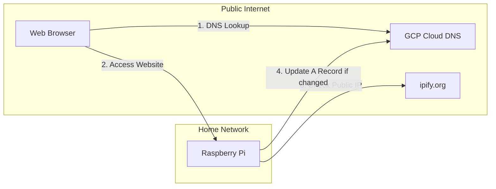
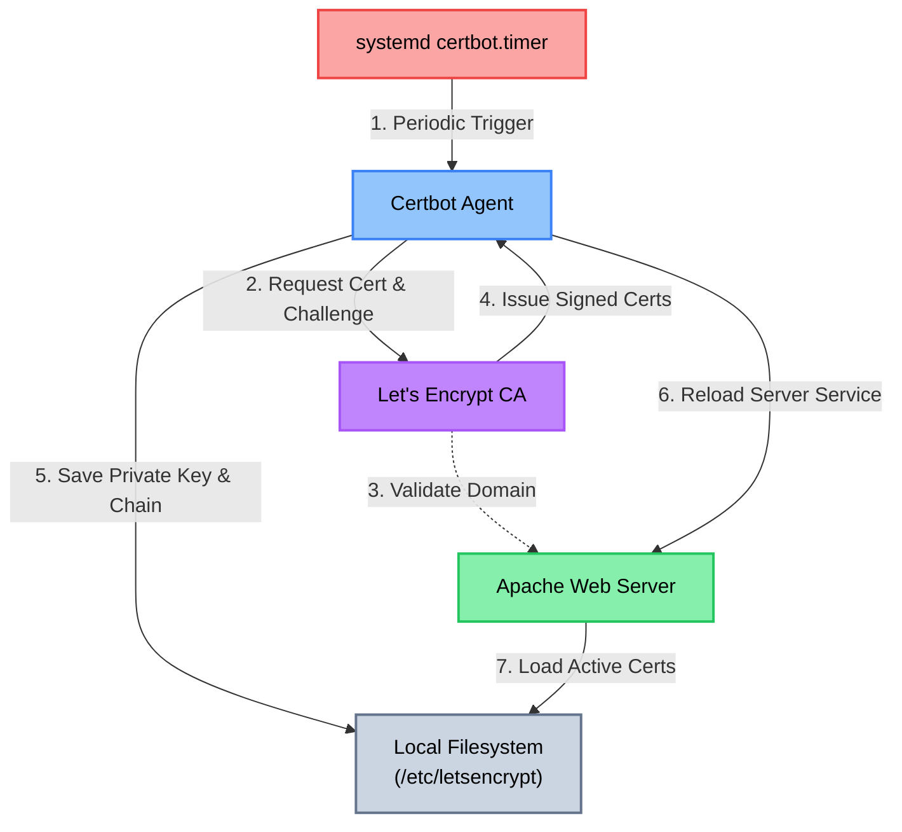
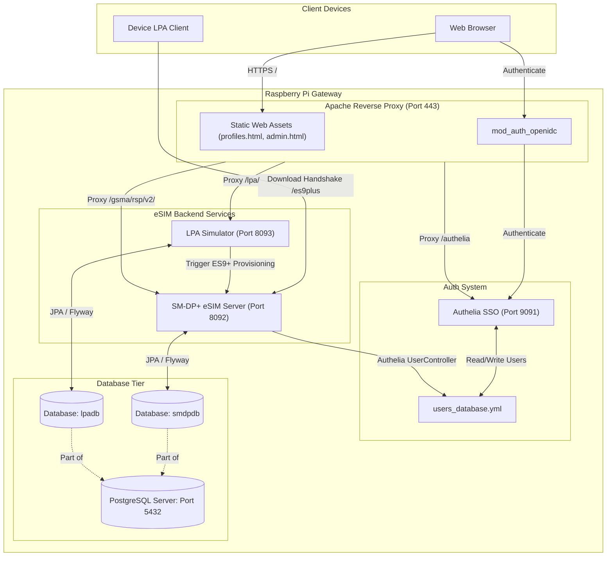

# hutta.in Portfolio & Platform: Consumer eSIM SM-DP+ & Secure Server Gateway

This repository contains the Infrastructure as Code (IaC), secure web portal assets, Authelia SSO authentication configurations, Certbot SSL/TLS certificate automation, and eSIM Remote SIM Provisioning (RSP) services needed to run a secure server gateway, status dashboard, and a local SM-DP+ eSIM provisioning environment on a home-hosted Raspberry Pi.

---

## 1. Dynamic DNS (DDNS) Architecture Overview

This diagram represents the flow for user access and the automated A-record updates when the home public IP changes.

1. **GCP Cloud DNS**: Manages the `hutta.in` DNS zone.
2. **Terraform**: Provisions the DNS Zone, record placeholders, and a secure GCP Service Account for updates.
3. **DDNS Script**: Runs on the Raspberry Pi. It checks its current public IP and, if it changes, logs into GCP via the service account to update the A record automatically.

---

## 2. Secure HTTPS & SSL/TLS via Certbot

To ensure all public-facing HTTP traffic is encrypted and secure, **Certbot (Let's Encrypt)** is integrated into the hosting environment.

* **Certificate Acquisition**: Certbot automatically provisions trusted, free SSL/TLS certificates from Let's Encrypt for `hutta.in` (and wildcard/subdomains).
* **Apache HTTPS Integration**: The certificates (private key and full chain cert) are loaded into the Apache HTTP Server (`/etc/apache2/sites-available/000-default-le-ssl.conf`), forcing all connections to upgrade to **HTTPS (port 443)** using modern TLS protocols.
* **Automated Renewals**: A systemd timer (`certbot.timer`) runs automatically twice a day to renew certificates nearing expiration and reloads Apache to apply the renewed certificates seamlessly without downtime.

---

## 3. Web Portal & eSIM Services System Architecture

This diagram shows how user devices, reverse proxy, authentication directories, and persistent database tiers interface on the Raspberry Pi.

* **Apache HTTP Server**: Serves the website frontend assets and acts as a secure reverse proxy with OIDC integration (`mod_auth_openidc`) for private routes.
* **Authelia**: Authenticates users against a local directory (`users_database.yml`) and handles Single Sign-On (SSO).
* **SM-DP+ eSIM Server**: Implements the standard GSMA SGP.22 endpoints (ES2+ and ES9+), backed by a persistent PostgreSQL database (`smdpdb`) and Flyway database migration controller.
* **LPA Simulator**: Simulates eUICC operations and triggers remote SIM provisioning downloads, storing downloaded profiles in a persistent PostgreSQL database (`lpadb`).

---

## 4. Projects & Repository Layout

This repository is split into five main areas:

### 1. [Infrastructure as Code & DDNS Automation (website-iac/)](website-iac/README.md)
Contains all GCP infrastructure provisioning and backend Dynamic DNS setup:
- Terraform configurations (`dns.tf`, `iam.tf`, `variables.tf`, etc.) for managing DNS zones and records.
- Zero-dependency Dynamic DNS Python script (`ddns.py`).
- Setup instructions for automating DDNS updates on the Raspberry Pi using systemd or cron.
- **Go to [website-iac/README.md](website-iac/README.md) for setup and deployment instructions.**

### 2. [Website Frontend (website/)](website/README.md)
Contains the server dashboard and portfolio site assets deployed on the Raspberry Pi:
- Frontend code (`index.html`, `index.css`, `app.js`, `profiles.html`, `admin.html`) for serving the portfolio site, eSIM profiles registry, LPA download simulator, and Authelia user management panel.
- Deployment configuration for Apache HTTP Server and HTTPS (SSL/TLS) via Let's Encrypt.
- GitHub Actions CI/CD setup via self-hosted runners.
- **Go to [website/README.md](website/README.md) for frontend deployment and automation setup instructions.**

### 3. [Authelia Authentication Setup (authelia/)](authelia/README.md)
Contains bare-metal installation scripts, password hash generators, and Apache server integration configuration for Authelia:
- Automated installation script (`install_authelia.sh`) for Raspberry Pi 5 / Debian systems.
- Apache web server OIDC configuration script (`configure_apache.sh`).
- **Go to [authelia/README.md](authelia/README.md) for detailed deployment and setup instructions.**

### 4. [SM-DP+ eSIM Server (smdp-plus/)](smdp-plus/README.md)
Contains a reference implementation of a GSMA SGP.22 v3.1 compliant Subscription Manager Data Preparation+ (SM-DP+) server:
- REST API controllers for ES2+ (Operator) and ES9+ (LPA client) interfaces.
- Persistent PostgreSQL database backend and Flyway schema versioning.
- Auto-deployment via self-hosted GitHub Actions workflows and systemd service.
- **Go to [smdp-plus/README.md](smdp-plus/README.md) for build, testing, and deployment instructions.**

### 5. [eSIM LPA Download Simulator (lpa-simulator/)](lpa-simulator/README.md)
Contains a client-side simulation helper that triggers standard remote SIM provisioning (RSP) download handshakes:
- REST API controller for starting profile download via activation code.
- Persistent PostgreSQL database backend and Flyway schema versioning.
- Automatic deployment configuration via systemd service on the Raspberry Pi.
- **Go to [lpa-simulator/README.md](lpa-simulator/README.md) for build, testing, and deployment instructions.**
