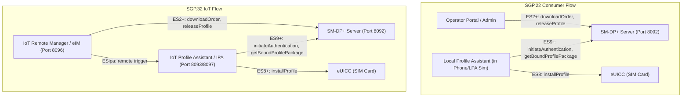
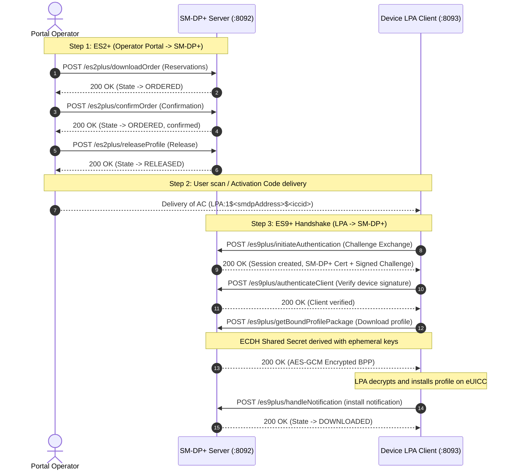
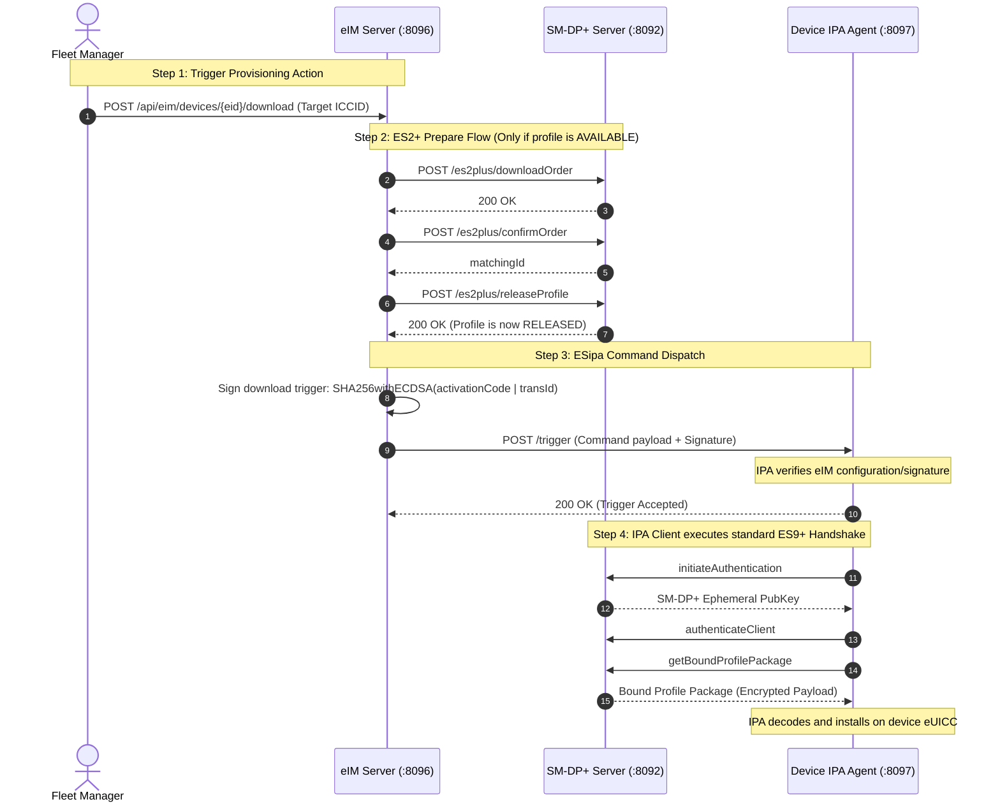

# hutta.in eSIM Platforms — User & Developer Guide

Welcome to the **hutta.in** eSIM Remote SIM Provisioning (RSP) console and developer gateway. This guide explains how the system implements both **Consumer eSIM (GSMA SGP.22)** and **IoT eSIM (GSMA SGP.32)** architectures, walkthroughs for both the web portal interfaces and the REST APIs, and step-by-step protocol sequences.

---

## 1. Architectural Overview

At a high level, Remote SIM Provisioning is split into two GSMA specification streams:



### Key Differences
* **SGP.22 (Consumer):** User-driven. The user scans a QR code (or inputs an activation code) on their device. The device's **LPA (Local Profile Assistant)** establishes the secure TLS handshake directly with the SM-DP+ and pulls down the eSIM profile.
* **SGP.32 (IoT):** Remote-driven (no screen/user input on the device). An **eIM (eUICC IoT Remote Manager)** pushes commands down to the device's **IPA (IoT Profile Assistant)**. The IPA is triggered remotely over-the-air to start the handshake with the SM-DP+.

---

## 2. Consumer eSIM (SGP.22) Protocol Flow

The Consumer eSIM provisioning cycle follows the GSMA ES2+ and ES9+ interfaces.

### 2.1 The Complete Step-by-Step Flow



---

## 2.2 UI Walkthrough (Consumer Console)

Access the Consumer eSIM dashboard by logging into `hutta.in` and navigating to **Consumer eSIM** (`consumer.html`).

#### Step 1: Import a Profile (Admin Only)
* Locate the **Import eSIM Profile** widget.
* Drag and drop a standard `.der`/`.bin` profile file, or select one.
* Click **Import Profile**. The profile will appear as **AVAILABLE** in the *eSIM Profiles Registry* table.

#### Step 2: Process the Order (Operator/Admin Only)
* Find the profile in the registry table.
* Click the blue **Order** button. Enter the target EID (default provided) and submit. The state becomes **ORDERED**.
* Click the orange **Confirm Order** button. The state is confirmed.
* Click the yellow **Release** button. The state becomes **RELEASED**, and the Activation Details area will update to show a **QR Code**.

#### Step 3: Simulate the Client Download
* Click the green **Download (LPA)** button next to your released profile. This automatically slides open the simulated iOS **LPA Simulator** floating window.
* Note that the **Activation Code String** (e.g., `LPA:1$localhost:8092$89000...`) is populated.
* Click **Download Profile** on the simulator. You will see a live console feed simulating the ES9+ cryptographic handshake (steps 1–4).
* Once finished, the status badge changes to **Success**. The profile state in the registry will automatically update to **DOWNLOADED**.
* In the LPA Simulator's **My Device eSIMs** tab, you can turn the profile's checkbox on/off to simulate **Enabling** and **Disabling** the profile (this sends notifications back to the SM-DP+).

---

## 2.3 REST API Reference (Consumer)

All APIs run on port **8092** relative to the SM-DP+ host.

#### 1. Download Order (ES2+)
```http
POST /gsma/rsp/v2/es2plus/downloadOrder
Content-Type: application/json
X-Admin-Protocol: gsma/rsp/v3.1.0

{
  "header": {
    "functionRequesterIdentifier": "HuttaPortal",
    "functionCallIdentifier": "TX-A100"
  },
  "eid": "89049032000008888888888888888801",
  "iccid": "89000123456789012399",
  "profileType": "Standard"
}
```
* **Response (200 OK):**
  ```json
  {
    "header": {
      "functionExecutionStatus": {
        "status": "Executed-Success",
        "code": "1",
        "message": "Success"
      }
    },
    "iccid": "89000123456789012399"
  }
  ```

#### 2. Confirm Order (ES2+)
```http
POST /gsma/rsp/v2/es2plus/confirmOrder
Content-Type: application/json
X-Admin-Protocol: gsma/rsp/v3.1.0

{
  "header": {
    "functionRequesterIdentifier": "HuttaPortal",
    "functionCallIdentifier": "TX-A101"
  },
  "iccid": "89000123456789012399",
  "eid": "89049032000008888888888888888801",
  "matchingId": "MATCHING-ID-999"
}
```

#### 3. Release Profile (ES2+)
```http
POST /gsma/rsp/v2/es2plus/releaseProfile
Content-Type: application/json
X-Admin-Protocol: gsma/rsp/v3.1.0

{
  "header": {
    "functionRequesterIdentifier": "HuttaPortal",
    "functionCallIdentifier": "TX-A102"
  },
  "iccid": "89000123456789012399"
}
```

#### 4. Initiate Authentication (ES9+)
```http
POST /gsma/rsp/v2/es9plus/initiateAuthentication
Content-Type: application/json

{
  "euiccChallenge": "bW9jay1jaGFsbGVuZ2U=",
  "smdpAddress": "localhost:8092",
  "euiccInfo1": "bW9jay1ldWljYy1pbmZv"
}
```

---

## 3. IoT eSIM (SGP.32) Protocol Flow

The SGP.32 IoT Remote Manager (eIM) triggers profile actions on devices using secure remote commands.

### 3.1 The Complete Step-by-Step Flow



---

## 3.2 UI Walkthrough (IoT eIM Console)

Access the IoT Fleet dashboard by navigating to **IoT eIM** (`iot.html`).

#### Step 1: Register a Device
* Go to the **Register IoT Device (eUICC)** card.
* Enter a 32-character hexadecimal **Device EID** (e.g. `89049032000008888888888888888801`).
* Give it a name/alias (e.g. `Smart Meter Alpha`) and click **Register IoT Device**.
* The device will appear in the *IoT Fleet Inventory* list.

#### Step 2: Connect and Trigger Download
* Click on your registered device in the *Fleet Inventory* table. The **eIM Remote Operations Console** and the **Simulated eUICC Registry** will expand.
* Select a profile from the **SM-DP+ Profiles** dropdown. 
  * *Tip:* Released profiles are grouped under the `✓ RELEASED` header. Available profiles will be ordered/confirmed/released automatically on-the-fly when triggered.
* Click **Trigger Remote Download (ESipa)**.
* Watch the **IPA Device Simulator Live Feed** console to see the over-the-air trigger signature validation, followed immediately by the automated client handshake and profile download steps.
* The installed profile will display in the *Simulated eUICC Registry* on the right side of the screen. You can remotely trigger **Disable**, **Enable**, or **Delete** (uninstall) operations.

---

### 3.3 REST API Reference (IoT)

#### 1. Register Device on eIM
```http
POST /api/eim/devices
Content-Type: application/json

{
  "eid": "89049032000008888888888888888801",
  "deviceName": "Smart Meter Alpha"
}
```

#### 2. Trigger Download on Device
```http
POST /api/eim/devices/89049032000008888888888888888801/download
Content-Type: application/json

{
  "iccid": "89000123456789012399",
  "profileType": "Standard"
}
```
* **System Action:** If the profile is `AVAILABLE`, the EIM service calls `smdp-plus` to order, confirm, and release the profile, then posts a signed command to the IPA simulator.
* **Response (200 OK):**
  ```json
  {
    "success": true,
    "message": "Download triggered successfully."
  }
  ```

#### 3. Trigger Remote Profile Action (PSMO)
```http
POST /api/eim/devices/89049032000008888888888888888801/psmo
Content-Type: application/json

{
  "iccid": "89000123456789012399",
  "operation": "ENABLE"
}
```
* **Supported operations:** `ENABLE`, `DISABLE`, `DELETE`.

---

## 4. Local Testing & Troubleshooting

### 4.1 Service Port Registry
When running services locally (e.g. on the Pi or ported to localhost), verify these bindings:

| Service Name | Port | Base Path |
|--------------|------|-----------|
| **Keycloak SSO** | `8080` (loopback) | `https://auth.hutta.in` |
| **SM-DP+ Server** | `8092` | `http://localhost:8092/gsma/rsp/v2` |
| **LPA Simulator** | `8093` / `8097` | `http://localhost:8093/lpa` (Web), `:8097/ipa` (eIM target) |
| **eIM Service** | `8096` | `http://localhost:8096/api/eim` |

### 4.2 Common Error Codes

#### `8.1.1` — Profile Not Available or Already Reserved
* **Cause:** The profile selected is already in an `ORDERED` or `RELEASED` state, and a client is attempting to execute `downloadOrder` again.
* **Solution:** EIM now dynamically skips the ES2+ lifecycle phases if the profile is already released. Verify profile states in the SM-DP+ admin registry list.

#### `Invalid EID Format`
* **Cause:** SGP.32 registration requires a 32-character hexadecimal string representing the eUICC identifier.
* **Solution:** Input a compliant 32-character string. The default placeholder (`89049032000008888888888888888801`) can be used for testing.

#### `IPA simulator offline or unreachable`
* **Cause:** The LPA Simulator service is not running on port 8093/8097, or port filtering rules are blocking the communication.
* **Solution:** Check the status of the simulator daemon (`systemctl status device-simulator.service`).
