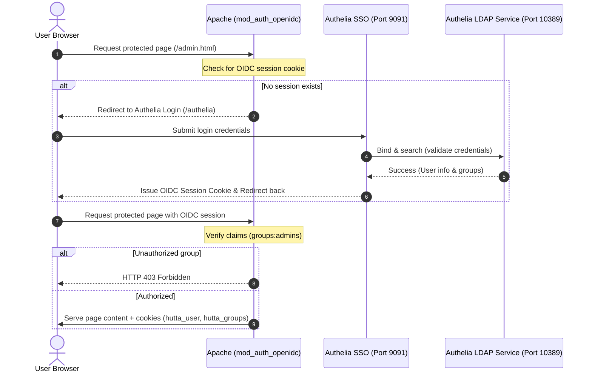

# Authelia Installation & Configuration

This directory contains scripts and configurations to install, update, and configure **Authelia** (an open-source authentication and authorization server) on a bare-metal Raspberry Pi 5 running Apache as a reverse proxy.

## Authentication Flow



## Contents

- **[install_authelia.sh](file:///Users/muku/Projects/website/authelia-ldap/install_authelia.sh)**: A comprehensive script to download the latest Authelia release, create a system user/group, set up configuration files (`/etc/authelia`), generate cryptographic secrets, hash administrator passwords, and register/start Authelia as a systemd service.
- **[configure_apache.sh](file:///Users/muku/Projects/website/scripts/configure_apache.sh)**: A script that installs the OpenID Connect module for Apache (`libapache2-mod-auth-openidc`), enables proxy modules, and configures Apache to reverse-proxy the `/authelia` subpath and secure specific paths (like `profiles.html` and `admin.html`) using OIDC authentication.
- **Spring Boot LDAP & Identity Service (authelia-ldap)**: A custom Java service running an embedded LDAP directory server (Port 10389) and user management API (Port 8094) backed by PostgreSQL (`autheliadb`).

---

## 1. Setup & Installation

### Prerequisites
- Running on a Raspberry Pi (or Debian-based system) with ARMhf or ARM64 architecture.
- Root or `sudo` access.
- Apache web server installed with Let's Encrypt SSL configured.

### Step 1: Install Authelia
Run the installation script with root privileges:
```bash
sudo ./install_authelia.sh
```

During installation, the script will:
1. Verify system dependencies (`curl`, `wget`, `tar`, `openssl`, etc.).
2. Detect system architecture.
3. Setup the system user and directories (`/etc/authelia`, `/var/lib/authelia`).
4. Download the latest binary from Github.
5. Generate or reload secure random secrets.
6. Prompt you for a secure administrator username, email, and password.
7. Generate Argon2 password hashes and write them to `/etc/authelia/users_database.yml`.
8. Write `/etc/authelia/configuration.yml`.
9. Setup, enable, and start the systemd service (`authelia.service`).

### Step 2: Configure Apache Reverse Proxy & OIDC Integration
Once Authelia is running, run the Apache configuration script:
```bash
sudo ../scripts/configure_apache.sh
```

This script will:
1. Install `libapache2-mod-auth-openidc` if not already installed.
2. Enable Apache modules: `proxy`, `proxy_http`, `auth_openidc`, `ssl`, and `headers`.
3. Backup your existing Apache configuration file (`/etc/apache2/sites-available/000-default-le-ssl.conf`).
4. Overwrite it to route `/authelia` to the local Authelia server and protect `/profiles.html` and `/admin.html` with OIDC.
5. Restart Apache.

---

## Configuration & Paths

- **Binary Location**: `/usr/local/bin/authelia`
- **Configuration Directory**: `/etc/authelia/`
  - `configuration.yml`: Global Authelia settings, OIDC providers, and access control policies.
  - `users_database.yml`: Local file user database with Argon2-hashed passwords.
- **Data Directory**: `/var/lib/authelia/`
  - `db.sqlite3`: Local SQLite database.
  - `notification.txt`: File-based notification notifier (e.g., outputs TOTP registration links).
- **Systemd Service**: `authelia.service`
  - Control with: `sudo systemctl [start|stop|restart|status] authelia`
  - Logs: `journalctl -u authelia.service`

---

## User Management

Authelia is configured to use a local file-based database for user records, located at `/etc/authelia/users_database.yml`.

### 1. Structure of `users_database.yml`
Each user entry has the following structure:
```yaml
users:
  username:
    displayname: "User Display Name"
    password: "argon2-hashed-password"
    email: "user@domain.com"
    groups:
      - admins
      - users
```

### 2. Adding or Modifying a User
To add a new user or change a password:
1. **Generate the Argon2 hash**:
   Use the Authelia binary to securely generate a password hash matching the Argon2 settings in `configuration.yml`:
   ```bash
   /usr/local/bin/authelia crypto hash generate argon2 --password "your-secure-password"
   ```
   *Example Output:*
   ```text
   $argon2id$v=19$m=65536,t=3,p=4$q9Y7U1L...
   ```
2. **Edit the database file**:
   Open `/etc/authelia/users_database.yml` as root:
   ```bash
   sudo nano /etc/authelia/users_database.yml
   ```
3. **Insert the user block**:
   Paste the username, display name, email, groups, and the hash you generated under the `users:` key.
4. **Secure the file permissions**:
   Ensure the `authelia` system user and group have access. To enable web-based administration from the `smdp-plus` backend (running as `rbpi`), add the `rbpi` user to the `authelia` group and set group write permissions:
   ```bash
   sudo chown authelia:authelia /etc/authelia/users_database.yml
   sudo chmod 660 /etc/authelia/users_database.yml
   sudo usermod -aG authelia rbpi
   ```
5. **Reload the database**:
   Restart Authelia to apply the changes:
   ```bash
   sudo systemctl restart authelia
   ```

---

## Authentication Integration (UI & API)

Authelia protects web assets and APIs using OpenID Connect (OIDC) or forward headers.

### 1. UI Authentication (OIDC in Apache)
To protect UI portals or web pages (e.g., `/profiles.html` and `/admin.html`):
1. **Configure mod_auth_openidc in Apache**:
   The `configure_apache.sh` script registers the `apache-portal` client and requests OIDC scopes:
   `OIDCScope "openid profile email groups"`
2. **Protect Specific Location Blocks**:
   Add the following inside your Apache VirtualHost configuration (`/etc/apache2/sites-available/000-default-le-ssl.conf`):
   ```apache
   # Protect the profiles registry (accessible to any valid user)
   <Location /profiles.html>
       AuthType openid-connect
       Require valid-user
   </Location>

   # Protect the user directory admin page (accessible only to admins)
   <Location /admin.html>
       AuthType openid-connect
       Require claim groups:admins
   </Location>
   ```
3. **How the Flow Works**:
   - The browser requests `/profiles.html` or `/admin.html`.
   - Apache intercepts the request and redirects the user to the Authelia portal if no active OIDC session exists.
   - The user authenticates. For `/admin.html`, Apache checks that the groups list claim includes `admins` before granting access.
   - OIDC claims are passed to the client via secure cookies (`hutta_user`, `hutta_groups`) so the frontend JavaScript knows the user context.

### 2. API Authentication
APIs can be secured using two methods depending on the type of client:

#### Method A: Session Cookie Forwarding (For SPA Frontends)
When your frontend JS (Single Page Application) communicates with an API hosted on the same domain (`hutta.in`):
1. **Configure Apache to protect the API path**:
   ```apache
   <Location /api>
       AuthType openid-connect
       Require valid-user
   </Location>
   ```
2. **Forwarding User context**:
   Apache automatically verifies the active OIDC session cookie and forwards user context to the backend API server in headers:
   - `OIDC_CLAIM_preferred_username` (or `Remote-User`)
   - `OIDC_CLAIM_email`
   - `OIDC_CLAIM_groups`

#### Method B: Bearer Tokens / OAuth2 (For CLI, Scripts & Third-party Clients)
For non-browser clients (such as Python scripts, curl, or mobile apps) that cannot perform interactive OIDC login:
1. **Verify Tokens in Backend**:
   The backend API can accept an OIDC `AccessToken` as a Bearer token in the `Authorization` header:
   ```text
   Authorization: Bearer <access-token-jwt>
   ```
2. **JWT Signature Verification**:
   The backend API verifies the JWT against Authelia's JSON Web Key Set (JWKS) endpoint:
   - **JWKS URI**: `https://hutta.in/authelia/jwks.json`
   - **OIDC Discovery Endpoint**: `https://hutta.in/authelia/.well-known/openid-configuration`
3. **Apache Token Introspection (Alternative)**:
   Alternatively, you can instruct Apache to validate Bearer tokens directly using `mod_auth_openidc`:
   ```apache
   <Location /api>
        AuthType oauth2
        Require valid-user
    </Location>
    ```

1. **Apache OIDC & Authelia SSO Combined Logout**:
   Direct the user's top-level browser window to the Apache OIDC logout URL, and pass Authelia's single-sign-out logout endpoint (with target redirect back to home page) in the `logout` query parameter:
   ```javascript
   // Clear local application cookies first
   document.cookie = "hutta_user=; Path=/; Expires=Thu, 01 Jan 1970 00:00:00 UTC; Secure; SameSite=Lax";
   document.cookie = "hutta_groups=; Path=/; Expires=Thu, 01 Jan 1970 00:00:00 UTC; Secure; SameSite=Lax";
   document.cookie = "hutta_auth=; Path=/; Expires=Thu, 01 Jan 1970 00:00:00 UTC; Secure; SameSite=Lax";
   
   // Redirect to clear both Apache session and Authelia session, then redirect to home
   window.location.replace('/redirect_uri?logout=https%3A%2F%2Fhutta.in%2Fauthelia%2Flogout%3Frd%3Dhttps%253A%252F%252Fhutta.in%252F');
   ```

---

## Custom Spring Boot LDAP & Identity Service (authelia-ldap)

In addition to Authelia configuration files, this directory contains a custom Spring Boot application that acts as an **Identity Provider (IdP) LDAP directory bridge**.

### Key Features
* **Embedded LDAP Server**: Runs an in-memory directory server (UnboundID) on port `10389`.
* **User Management API**: Exposes standard REST endpoints (on port `8094`) to perform CRUD operations on user accounts and groups.
* **Bootstrapping**: Automatically loads initial user data from `/etc/authelia/users_database.yml` on first startup if the database is empty.
* **PostgreSQL Synchronization**: Keeps user directory data synced with a persistent PostgreSQL database (`autheliadb`) and dynamically updates the LDAP directory in real-time.

### Compilation and Build
To compile the Spring Boot application, run:
```bash
mvn clean package
```

### Pi Service Setup
To register and run this service on your Raspberry Pi:
1. Build the jar file on the Pi or copy the built jar to `/home/rbpi/authelia-ldap/authelia-ldap.jar`.
2. Run the registration script:
   ```bash
   sudo ./setup_pi_service.sh
   ```
3. Start the service:
   ```bash
   sudo systemctl start authelia-ldap
   ```
