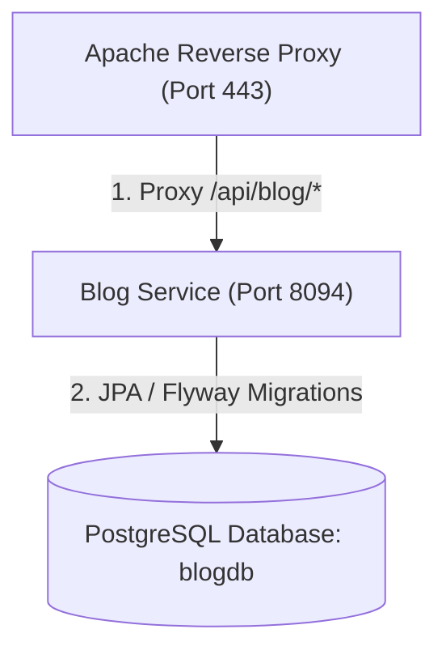

# Technology Blog Backend Service

This directory contains the Spring Boot backend module that handles CRUD operations for hutta.in technology blog articles and binary image uploads.

---

## 1. System Architecture

The blog service is designed to run as a systemd background daemon on the home-hosted Raspberry Pi, interfacing with a persistent PostgreSQL database instance.



* **REST API**: Exposes JSON endpoints under `/api/blog/posts` (read/write blog articles) and `/api/blog/images` (upload banner images).
* **OIDC Security Verification**: Write endpoints (POST, PUT, DELETE) extract user roles from request headers set by Apache's OIDC module (`OIDC_CLAIM_preferred_username`) or cookies (`hutta_user`), automatically validating sessions against Keycloak.
* **BYTEA Storage**: Embedded binary assets (images) are stored directly inside the PostgreSQL database `blog_image` table to eliminate the need for persistent filesystem directories and prevent storage permission errors.

---

## 2. Technologies Used

- **Spring Boot 3.x**: Application framework.
- **Spring Data JPA & Hibernate**: Database mapping layer.
- **Flyway DB**: Automatic database schema migrations.
- **PostgreSQL**: Production relational database backend.

---

## 3. Configuration & Local Execution

Database connection properties are configured inside [application.yml](src/main/resources/application.yml).

### Local Running

To run the blog backend locally in development mode:
```bash
mvn spring-boot:run
```

By default, development mode skips authorization checks if the Host header is `localhost` or `127.0.0.1` and automatically assigns the author `Mukesh Joshi`.

---

## 4. Raspberry Pi Production Setup

The service runs under a systemd daemon service definition.

### 1. Manual Setup (from project directory)
```bash
# Copy setup script to Pi
scp blog-service/setup_pi_service.sh rbpi@hutta.in:/home/rbpi/blog-service/setup_pi_service.sh

# Run the script
ssh rbpi@hutta.in "chmod +x /home/rbpi/blog-service/setup_pi_service.sh && sudo /home/rbpi/blog-service/setup_pi_service.sh"
```

### 2. Service Management
```bash
# Check status
sudo systemctl status blog-service

# View active logs
journalctl -u blog-service -f
```

---

## 5. CI/CD Deployment

The GitHub Actions deployment workflow is defined at [.github/workflows/deploy-blog.yml](../.github/workflows/deploy-blog.yml). Upon push modifications to files under `blog-service/**`, the self-hosted runner compiles the jar, places the updated package under `/home/rbpi/blog-service/blog-service.jar` on the Pi, and runs a service reload.
