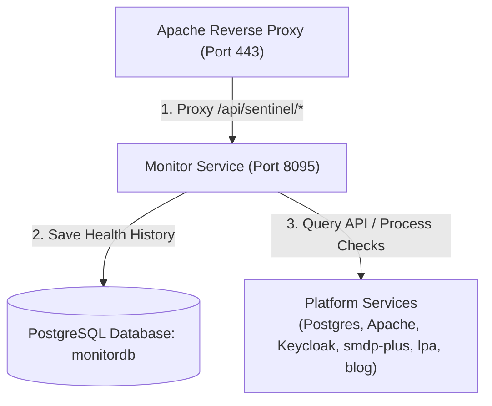

# Sentinel Monitor Service

This directory contains the Spring Boot backend module that handles system integrity checking, service status validation, and version detection for all running Hutta platform services.

---

## 1. System Architecture

The monitor service runs as a systemd background daemon on the home-hosted Raspberry Pi, exposing endpoints to verify the health and version information of the entire stack.



### Key Features
- **Health Aggregator:** Regularly checks and reports on the systemd service states of PostgreSQL, Apache, Keycloak, SM-DP+, LPA Simulator, and the Blog Service.
- **Dynamic Version Extraction:** Runs safe, high-performance hooks to discover installed service versions:
  - **Spring Boot microservices** (`smdp-plus`, `lpa-simulator`, `blog-service`, `monitor-service`): Reads `META-INF/maven/in.hutta/<name>/pom.properties` from deployed JAR paths, falling back to local source directories during development.
  - **Keycloak:** Scans `/opt/keycloak/lib/lib/main` for the keycloak-core jar to detect the runtime version.
  - **Apache:** Invokes `/usr/sbin/apache2 -v` and parses the output.
  - **PostgreSQL:** Invokes `pg_config --version`.
- **Database Backend:** Persists monitoring results and metrics history inside the `monitordb` PostgreSQL database.

---

## 2. Technologies Used

- **Spring Boot 3.x**: Application framework.
- **Spring Data JPA & Hibernate**: Persistence mapping.
- **Flyway DB**: Database schema migrations.
- **PostgreSQL**: Production relational database backend.

---

## 3. Configuration & Local Execution

Database connection and thread scheduler properties are configured inside [application.yml](src/main/resources/application.yml).

### Local Running

To run the monitoring service locally in development mode:
```bash
mvn spring-boot:run
```

---

## 4. Raspberry Pi Production Setup

The service runs under a systemd daemon service definition.

### 1. Manual Setup (from project directory)
```bash
# Copy setup script to Pi
scp monitor-service/setup_pi_service.sh rbpi@hutta.in:/home/rbpi/monitor-service/setup_pi_service.sh

# Run the script
ssh rbpi@hutta.in "chmod +x /home/rbpi/monitor-service/setup_pi_service.sh && sudo /home/rbpi/monitor-service/setup_pi_service.sh"
```

### 2. Service Management
```bash
# Check status
sudo systemctl status monitor-service

# View active logs
journalctl -u monitor-service -f
```

---

## 5. CI/CD Deployment

The GitHub Actions deployment workflow is defined at [.github/workflows/deploy-monitor.yml](../.github/workflows/deploy-monitor.yml). Upon push modifications to files under `monitor-service/**`, the self-hosted runner compiles the jar, places the updated package under `/home/rbpi/monitor-service/monitor-service.jar` on the Pi, and reloads the service daemon.
