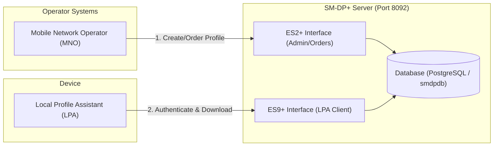

# SM-DP+ Server Installation & Configuration (GSMA SGP.22 v3.1)

This directory contains a lightweight, modular reference implementation of a GSMA SGP.22 v3.1 compliant **Subscription Manager Data Preparation+ (SM-DP+)** server in Java 21 using Spring Boot 3.3.0, optimized to run bare-metal on a Raspberry Pi.

## System Architecture



## Contents

- **[pom.xml](file:///Users/muku/Projects/website/smdp-plus/pom.xml)**: The Maven dependency configuration (Spring Web, JPA, PostgreSQL Driver, Flyway Migration, Lombok, BouncyCastle, and Jackson YAML).
- **[setup_pi_service.sh](file:///Users/muku/Projects/website/smdp-plus/setup_pi_service.sh)**: A one-time setup script to create the deployment directory `/home/rbpi/smdp-plus` and register the `smdp-plus.service` systemd service.
- **[Source Code](file:///Users/muku/Projects/website/smdp-plus/src/main/java/in/hutta/smdp/)**: The core Java implementation, including REST controllers, business services, DTO mappings, and the pluggable cryptographic session manager.
- **[Tests](file:///Users/muku/Projects/website/smdp-plus/src/test/java/in/hutta/smdp/)**: Integration test suite verifying the eSIM profile provisioning lifecycle (`SmdpIntegrationTest.java`).

---

## 1. Setup & Installation

### Prerequisites
- Java 21 JDK (OpenJDK 21) installed on the Raspberry Pi.
- Maven 3.x installed on the Raspberry Pi.
- A self-hosted GitHub Actions runner active on the Pi (for automated deployments).

### Step 1: Install Dependencies (Manual)
Log into your Raspberry Pi and install the JDK 21 compiler and Maven:
```bash
sudo apt-get update
sudo apt-get install -y openjdk-21-jdk maven
```

### Step 2: Register Systemd Service
Run these commands to copy the setup script to the Pi and register the background systemd service:
```bash
# Create directory if not exists
ssh rbpi@hutta.in "mkdir -p /home/rbpi/smdp-plus"

# Copy the setup script
scp smdp-plus/setup_pi_service.sh rbpi@hutta.in:/home/rbpi/smdp-plus/setup_pi_service.sh

# Run the script to register and enable the service
ssh rbpi@hutta.in "chmod +x /home/rbpi/smdp-plus/setup_pi_service.sh && sudo /home/rbpi/smdp-plus/setup_pi_service.sh"
```

---

## 2. Configuration & Paths

- **JAR Binary Location**: `/home/rbpi/smdp-plus/smdp-plus.jar`
- **Port Configuration**: `8092` (configured in [application.yml](file:///Users/muku/Projects/website/smdp-plus/src/main/resources/application.yml))
- **Systemd Service**: `smdp-plus.service`
  - Start/Stop: `sudo systemctl [start|stop|restart] smdp-plus`
  - Status: `sudo systemctl status smdp-plus`
  - Logs: `sudo journalctl -u smdp-plus -f -n 100`
- **PostgreSQL Database**:
  - JDBC URL: `jdbc:postgresql://localhost:5432/smdpdb`
  - Username: `smdp` / Password: generated by `setup_postgres.sh` (printed to console during setup — store it in your application config/secrets manager)

---

## 3. Profile Management & TS.48 Test Profiles Import

eSIM profiles are imported and managed dynamically at runtime using the Admin API or by placing orders. You can import official generic GSMA test profiles (such as those from the TS.48 specification) directly.

### Importing GSMA TS.48 Test Profiles
1. **Download the profiles**:
   Clone the public repository containing the generic profile packages:
   ```bash
   git clone https://github.com/GSMATerminals/Generic-eUICC-Test-Profile-for-Device-Testing-Public.git
   ```
2. **Convert the `.der` file to Base64**:
   Convert the binary ASN.1 DER-encoded profile to a single-line Base64 payload:
   - *macOS/Linux*:
     ```bash
     base64 -i path/to/profile.der -o profile.b64
     ```
   - *Windows (PowerShell)*:
     ```powershell
     [Convert]::ToBase64String([IO.File]::ReadAllBytes("path/to/profile.der")) | Out-File -Encoding utf8 profile.b64
     ```
3. **POST the Profile to the Admin API**:
   Import the profile payload using the Admin API endpoint `/gsma/rsp/v2/admin/importProfile`:
   ```bash
   curl -X POST http://<your-pi-ip>:8092/gsma/rsp/v2/admin/importProfile \
     -H "Content-Type: application/json" \
     -d "{
       \"iccid\": \"8900000000000000001f\",
       \"profilePayload\": \"$(cat profile.b64 | tr -d '\n\r')\"
     }"
   ```

---

## 4. Remote SIM Provisioning (RSP) REST APIs

The server implements the standard SGP.22 endpoints under `HTTP POST` mapping:

### 1. ES2+ Interface (Operator Integration)
Used by operators to order and release eSIM profiles for a given EID.
- **Download Order**:
  ```text
  POST /gsma/rsp/v2/es2plus/downloadOrder
  ```
- **Confirm Order**:
  ```text
  POST /gsma/rsp/v2/es2plus/confirmOrder
  ```
- **Release Profile**:
  ```text
  POST /gsma/rsp/v2/es2plus/releaseProfile
  ```
- **Cancel Order**:
  ```text
  POST /gsma/rsp/v2/es2plus/cancelOrder
  ```

### 2. ES9+ Interface (LPA Device Integration)
Used by the Local Profile Assistant (LPA) on the user's device to authenticate and download the Bound Profile Package.
- **Initiate Authentication**:
  ```text
  POST /gsma/rsp/v2/es9plus/initiateAuthentication
  ```
- **Authenticate Client**:
  ```text
  POST /gsma/rsp/v2/es9plus/authenticateClient
  ```
- **Get Bound Profile Package (BPP)**:
  ```text
  POST /gsma/rsp/v2/es9plus/getBoundProfilePackage
  ```
- **Cancel Session**:
  ```text
  POST /gsma/rsp/v2/es9plus/cancelSession
  ```


## 5. Running Tests

To run the complete automated integration test suite (incorporating RSP profile provisioning flows):
```bash
mvn clean test
```

---

## 6. Automated CI/CD (GitHub Actions)

We use the self-hosted GitHub Actions runner on the Raspberry Pi to automate deployment.

### Deployment Workflow
The workflow **[deploy-smdp.yml](file:///Users/muku/Projects/website/.github/workflows/deploy-smdp.yml)** triggers on every push to `main` targeting files in `smdp-plus/**`:
1. Checks out the code inside the runner's workspace on the Pi.
2. Compiles and packages the Spring Boot application using Maven:
   ```bash
   mvn clean package -DskipTests
   ```
3. Copies the output JAR file to the application home directory: `/home/rbpi/smdp-plus/smdp-plus.jar`.
4. Gracefully restarts the application service:
   ```bash
   sudo systemctl restart smdp-plus.service
   ```

---

## 7. Security Hardening & Standards Compliance (SAS FS.18 & SGP.22)

The server incorporates strict security mechanisms to comply with GSMA SGP.22 and SAS FS.18 guidelines:

### 1. Database-at-Rest Encryption (SAS FS.18 Area B)
* Sensitive eSIM profiles are GCM-encrypted at the database column level (`Profile.profilePayload`) using the JPA `@Converter` [CryptoConverter.java](file:///Users/muku/Projects/website/smdp-plus/src/main/java/in/hutta/smdp/util/CryptoConverter.java).
* Uses **AES-GCM-256** with dynamic 12-byte random initialization vectors (IVs) prepended to the ciphertext.
* Decryption is handled transparently during entity loading. The encryption key is loaded on boot from environment secrets (`smdp.db-encryption-key`).

### 2. Persistent Cryptographic Keystore (SAS FS.18 Area A)
* The SM-DP+ EC identity key pair and root-signed certificate are stored persistently in a password-protected PKCS12 file (`smdp-keystore.p12`).
* This maintains the server's cryptographic identity across reboots, satisfying SAS key-lifecycle policies and avoiding client connection issues.

### 3. Compliant PKI Certificate Chain Verification (SGP.22 Section 5.7)
* During the client handshake, the server expects a 4-element `AuthenticateServerResponse` DER sequence: `[euiccSigned1, euiccSignature1, euiccCertificate, eumCertificate]`.
* Performs PKIX path validation up to a GSMA Root CA trust anchor:
  1. Verifies the `eumCertificate` is signed by the trusted GSMA Root CA.
  2. Verifies the `euiccCertificate` is signed by the validated EUM certificate.
  3. Validates expiration dates, constraints, and key usages.
* Extracts the validated public key from the eUICC certificate to verify the client's signature.
