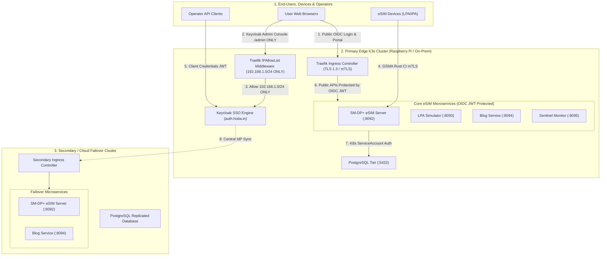

# Authentication & Authorization Architecture (Single & Multi-Cluster Setup)

This document specifies the complete **Authentication (AuthN)** and **Authorization (AuthZ)** architecture for the `hutta.in` consumer/IoT eSIM platform across single and multi-cluster Kubernetes deployments.

---

## 1. High-Level Multi-Cluster Identity & Security Architecture

---

## 2. Ingress & Access Policy Matrix

| Route & Path | Target Service | Access Level | Protection Mechanism |
|---|---|---|---|
| **Keycloak Admin Console** (`auth.hutta.in/admin/*`, `/realms/master/*`) | `keycloak-service` | **Home IP Subnet Only** (`192.168.1.0/24`) | Traefik `IPAllowList` Middleware (`403 Forbidden` for public IPs) |
| **Keycloak Public OIDC** (`auth.hutta.in/realms/hutta/*`) | `keycloak-service` | **Public Internet** | SSL/TLS + PKCE / OAuth2 Standards |
| **Microservice APIs** (`hutta.in/api/*`) | `smdp-plus`, `device-simulator`, `blog-service`, `monitor-service` | **Public Internet** | Keycloak RS256 JWT Token Validation & Spring Security Roles |
| **GSMA ES9+ Device Handshake** (`hutta.in/api/smdp/es9plus/*`) | `smdp-plus-service` | **Public Internet** | GSMA Root CI Mutual TLS (mTLS) Device Certificate Validation |
| **Static Web Portal Gateway** (`hutta.in/`) | `website-portal-service` | **Public Internet** | TLS 1.3 Encryption |

---

## 3. Authentication (AuthN) Matrix by Entity

| Entity | AuthN Mechanism | Credential / Token Type | Issuer & Verification |
|---|---|---|---|
| **Human Users / Admins** | Keycloak SSO OIDC (Authorization Code Flow with PKCE) | Short-Lived JWT Access Token (15 min) + Refresh Token | Issued by `https://auth.hutta.in/realms/hutta` (RS256 Signature) |
| **API Operators / Systems** | OAuth2 Client Credentials Flow | Client ID + Secret -> JWT Access Token | Keycloak Token Endpoint (`/realms/hutta/protocol/openid-connect/token`) |
| **GSMA eSIM Devices (LPA/IPA)** | GSMA Root CI Mutual TLS (mTLS) | X.509 Device Certificate issued by GSMA Cert Authority | Validated against GSMA Root Certificate Chain inside `smdp-plus` |
| **Microservice Pods (Pod-to-Pod)** | K8s ServiceAccount Tokens / SPIFFE mTLS | ServiceAccount JWT (`/var/run/secrets/kubernetes.io/serviceaccount`) | Verified by Kubernetes API Server |
| **Multi-Cluster Federation** | Central OIDC Identity Provider | Keycloak OIDC Discovery (`/.well-known/openid-configuration`) | Keycloak as Centralized IdP across all clusters |

---

## 4. Authorization (AuthZ) & Access Control Layers

### Layer 1: Ingress Boundary Control
* **Keycloak Admin Console**: Enforces Traefik `keycloak-admin-ip-allowlist` restricting `/admin` and `/realms/master` strictly to `192.168.1.0/24`.
* **Platform APIs**: Open to public internet traffic, delegating AuthN/AuthZ to Spring Security JWT verification.

### Layer 2: Keycloak Role-Based Access Control (RBAC)
* **Realm Roles**:
  - `hutta:user`: Access consumer profile download tools (`/tools.html`).
  - `hutta:operator`: Access ES2+ reservation & profile release APIs (`/api/smdp/es2plus/*`).
  - `hutta:admin`: Full administrative control across Keycloak, Sentinel monitor, and database migrations.

### Layer 3: Kubernetes API Server RBAC (Multi-Cluster Least Privilege)
Each cluster defines explicit `ServiceAccount`, `Role`, and `RoleBinding` resources.

### Layer 4: Multi-Cluster Federation & GitOps Synchronization
ArgoCD synchronizes identical NetworkPolicies, RoleBindings, and Security Contexts across all clusters automatically.
