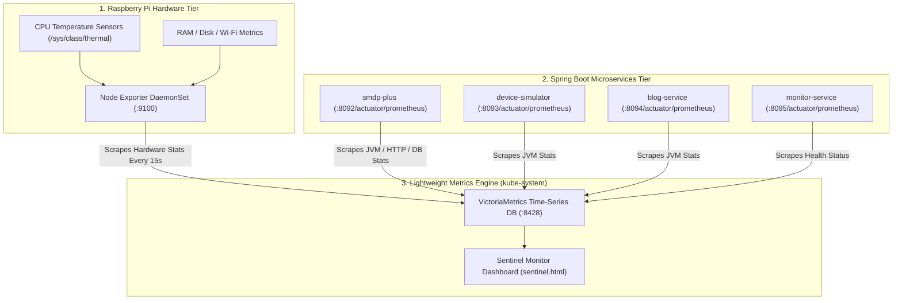

# Infrastructure & Application Monitoring Architecture

This document describes the monitoring, observability, and alerting strategy for the `hutta.in` platform running on the 3-node Raspberry Pi K8s cluster.

---

## 1. Observability Architecture Overview

To fit within the memory constraints of 8GB Raspberry Pis, we use **VictoriaMetrics Single-Node** (uses <40MB RAM compared to standard Prometheus 1GB+) combined with **Node Exporter** and **Spring Boot Actuator Micrometer**.



---

## 2. Infrastructure Monitoring (Hardware & Kubernetes Node Tier)

### A. Monitored Hardware Metrics:
* **CPU Temperature**: Scraped from `/sys/class/thermal/thermal_zone0/temp`. Alert triggers if CPU temp > 75°C.
* **RAM & Swap Usage**: Tracks free memory and verifies `swap` is 0MB (SD card protection).
* **Wi-Fi Signal & Latency**: Link quality metrics on `wlan0`.
* **MicroSD Card Disk I/O**: Read/Write IOPS and storage capacity.

### B. CLI Commands for Immediate Node Inspection:
```bash
# Check CPU & RAM consumption per Node
kubectl top nodes

# Check CPU & RAM consumption per Pod
kubectl top pods -A

# Check Node Exporter metrics
curl http://192.168.1.100:9100/metrics | grep node_cooling_device_cur_state
```

---

## 3. Application Monitoring (Spring Boot Microservices & Keycloak)

All Spring Boot microservices expose real-time metrics via Micrometer at `/actuator/prometheus`:

### A. Key Application Metrics:
| Metric Category | Prometheus Metric Name | Description |
|---|---|---|
| **JVM Memory** | `jvm_memory_used_bytes` | Live JVM heap & non-heap memory usage |
| **Garbage Collection** | `jvm_gc_pause_seconds_sum` | GC pause durations and frequency |
| **HTTP Request Latency** | `http_server_requests_seconds_bucket` | Response latency distribution per endpoint |
| **Database Connection Pool** | `hikaricp_connections_active` | Active PostgreSQL database connections |
| **eSIM Profile Downloads** | `esim_profile_download_total` | Business counter for successful eSIM activations |

### B. Sentinel Dashboard (`https://hutta.in/sentinel.html`)
The built-in `monitor-service` provides a real-time visual status page showing:
* Status of all 3 Pis (`rbpi-master`, `rbpi-worker-01`, `rbpi-worker-02`).
* Health of SM-DP+, LPA Simulator, Blog, Keycloak SSO, and PostgreSQL database.

---

## 4. How to Deploy & Access Monitoring

```bash
# 1. Deploy VictoriaMetrics & Node Exporter
kubectl apply -f website-iac/k8s/infrastructure/monitoring.yaml

# 2. Port-forward VictoriaMetrics UI to local laptop
kubectl port-forward svc/victoriametrics-service -n kube-system 8428:8428

# 3. Access VictoriaMetrics Web UI in browser:
# Open http://localhost:8428/vmui
```
